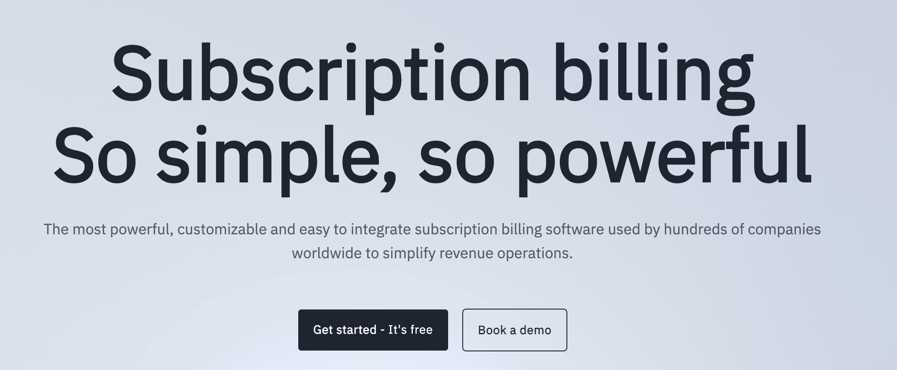

<div align="left">

[](https://www.billsby.com&#x2F;)

# [Billsby](https://www.billsby.com&#x2F;)<a id="billsby"></a>

Billsby is a feature-rich "Saas" recurring payment platform, ranked as the leading subscription billing software by G2.

Billsby is designed to ensure customers can go live quickly, often within 1-2 hours.  To help facilitate this process we have a team of friendly knowledgeable advisors ready to help your business go live.    

Billsby specializes in providing great customer service at an affordable price point - our technology is rated No 1 on G2 by our customers.

If you are a developer creating a solution for your customer, Billsby has a friendly well-documented API.  The Billsby team are here to provide support to developers in order to ensure a smooth migration or new system build. 

Why not book a call, talk through your Billing requirements and we can let you know how we can help you transform your business..

</div>

## Table of Contents<a id="table-of-contents"></a>

<!-- toc -->

- [Installation](#installation)
- [Getting Started](#getting-started)
- [Reference](#reference)
  * [`billsby.addon.getAddonList`](#billsbyaddongetaddonlist)
  * [`billsby.addon.getDetails`](#billsbyaddongetdetails)
  * [`billsby.addon.listAvailableAddons`](#billsbyaddonlistavailableaddons)
  * [`billsby.allowance.getDetails`](#billsbyallowancegetdetails)
  * [`billsby.allowance.getList`](#billsbyallowancegetlist)
  * [`billsby.allowance.getSpecificSubscriptionAllowances`](#billsbyallowancegetspecificsubscriptionallowances)
  * [`billsby.creditnote.list`](#billsbycreditnotelist)
  * [`billsby.creditnote.reattemptPayment`](#billsbycreditnotereattemptpayment)
  * [`billsby.customField.createNewField`](#billsbycustomfieldcreatenewfield)
  * [`billsby.customField.getResponse`](#billsbycustomfieldgetresponse)
  * [`billsby.customField.list`](#billsbycustomfieldlist)
  * [`billsby.customField.updateField`](#billsbycustomfieldupdatefield)
  * [`billsby.customer.addSubscriptionToExistingCustomer`](#billsbycustomeraddsubscriptiontoexistingcustomer)
  * [`billsby.customer.clearGdprData`](#billsbycustomercleargdprdata)
  * [`billsby.customer.createNewCustomerAndSubscription`](#billsbycustomercreatenewcustomerandsubscription)
  * [`billsby.customer.createWithoutSubscription`](#billsbycustomercreatewithoutsubscription)
  * [`billsby.customer.deleteById`](#billsbycustomerdeletebyid)
  * [`billsby.customer.getCreditNotes`](#billsbycustomergetcreditnotes)
  * [`billsby.customer.getDetails`](#billsbycustomergetdetails)
  * [`billsby.customer.getFeatureTags`](#billsbycustomergetfeaturetags)
  * [`billsby.customer.getSubscriptionsByUniqueId`](#billsbycustomergetsubscriptionsbyuniqueid)
  * [`billsby.customer.listCustomers`](#billsbycustomerlistcustomers)
  * [`billsby.customer.updateCustomFieldResponse`](#billsbycustomerupdatecustomfieldresponse)
  * [`billsby.customer.updateDetails`](#billsbycustomerupdatedetails)
  * [`billsby.customer.updatePaymentCardToken`](#billsbycustomerupdatepaymentcardtoken)
  * [`billsby.customer.updatePaymentDetailsRequest`](#billsbycustomerupdatepaymentdetailsrequest)
  * [`billsby.invoice.createOneTimeCharge`](#billsbyinvoicecreateonetimecharge)
  * [`billsby.invoice.createRefund`](#billsbyinvoicecreaterefund)
  * [`billsby.invoice.details`](#billsbyinvoicedetails)
  * [`billsby.invoice.getCustomerInvoices`](#billsbyinvoicegetcustomerinvoices)
  * [`billsby.invoice.getPaymentLogs`](#billsbyinvoicegetpaymentlogs)
  * [`billsby.invoice.listCompanyInvoices`](#billsbyinvoicelistcompanyinvoices)
  * [`billsby.invoice.markAsPaidOffline`](#billsbyinvoicemarkaspaidoffline)
  * [`billsby.invoice.markWrittenOff`](#billsbyinvoicemarkwrittenoff)
  * [`billsby.invoice.reattemptPayment`](#billsbyinvoicereattemptpayment)
  * [`billsby.product.createCycle`](#billsbyproductcreatecycle)
  * [`billsby.product.createNewProduct`](#billsbyproductcreatenewproduct)
  * [`billsby.product.createPlan`](#billsbyproductcreateplan)
  * [`billsby.product.getDetails`](#billsbyproductgetdetails)
  * [`billsby.product.listPlans`](#billsbyproductlistplans)
  * [`billsby.product.listProducts`](#billsbyproductlistproducts)
  * [`billsby.product.updatePlanAndCycle`](#billsbyproductupdateplanandcycle)
  * [`billsby.product.updatePlanOrder`](#billsbyproductupdateplanorder)
  * [`billsby.product.updateProduct`](#billsbyproductupdateproduct)
  * [`billsby.subscription.addFeatureTags`](#billsbysubscriptionaddfeaturetags)
  * [`billsby.subscription.cancelSubscription`](#billsbysubscriptioncancelsubscription)
  * [`billsby.subscription.changePlan`](#billsbysubscriptionchangeplan)
  * [`billsby.subscription.featureTagsSplit`](#billsbysubscriptionfeaturetagssplit)
  * [`billsby.subscription.getCountersValue`](#billsbysubscriptiongetcountersvalue)
  * [`billsby.subscription.getDetails`](#billsbysubscriptiongetdetails)
  * [`billsby.subscription.getEventLogs`](#billsbysubscriptiongeteventlogs)
  * [`billsby.subscription.getShippingAddress`](#billsbysubscriptiongetshippingaddress)
  * [`billsby.subscription.listSubscriptions`](#billsbysubscriptionlistsubscriptions)
  * [`billsby.subscription.listTagsBySubscription`](#billsbysubscriptionlisttagsbysubscription)
  * [`billsby.subscription.removeFeatureTag`](#billsbysubscriptionremovefeaturetag)
  * [`billsby.subscription.updateCounter`](#billsbysubscriptionupdatecounter)
  * [`billsby.subscription.updateRenewalDate`](#billsbysubscriptionupdaterenewaldate)
  * [`billsby.subscription.updateShippingAddress`](#billsbysubscriptionupdateshippingaddress)

<!-- tocstop -->

## Installation<a id="installation"></a>
<div align="center">
  <a href="https://konfigthis.com/sdk-sign-up?company=Billsby&language=TypeScript">
    
  </a>
</div>

## Getting Started<a id="getting-started"></a>

```typescript
import { Billsby } from "billsby-typescript-sdk";

const billsby = new Billsby({
  // Defining the base path is optional and defaults to https://public.billsby.com/api/v1/rest/core
  // basePath: "https://public.billsby.com/api/v1/rest/core",
  apiKey: "API_KEY",
});

const getAddonListResponse = await billsby.addon.getAddonList({
  companyDomain: "companyDomain_example",
  subscriptionUniqueId: "subscriptionUniqueId_example",
});

console.log(getAddonListResponse);
```

## Reference<a id="reference"></a>


### `billsby.addon.getAddonList`<a id="billsbyaddongetaddonlist"></a>


#### 🛠️ Usage<a id="🛠️-usage"></a>

```typescript
const getAddonListResponse = await billsby.addon.getAddonList({
  companyDomain: "companyDomain_example",
  subscriptionUniqueId: "subscriptionUniqueId_example",
});
```

#### ⚙️ Parameters<a id="⚙️-parameters"></a>

##### companyDomain: `string`<a id="companydomain-string"></a>

Your companies Billsby subdomain - for example, if you login at widgets.billsby.com, your companyDomain is widgets

##### subscriptionUniqueId: `string`<a id="subscriptionuniqueid-string"></a>

The unique identifier of the subscription in the Billsby platform

#### 🌐 Endpoint<a id="🌐-endpoint"></a>

`/{companyDomain}/subscriptions/{subscriptionUniqueId}/addons` `GET`

[🔙 **Back to Table of Contents**](#table-of-contents)

---


### `billsby.addon.getDetails`<a id="billsbyaddongetdetails"></a>


#### 🛠️ Usage<a id="🛠️-usage"></a>

```typescript
const getDetailsResponse = await billsby.addon.getDetails({
  companyDomain: "companyDomain_example",
  addonId: 1,
});
```

#### ⚙️ Parameters<a id="⚙️-parameters"></a>

##### companyDomain: `string`<a id="companydomain-string"></a>

Your companies Billsby subdomain - for example, if you login at widgets.billsby.com, your companyDomain is widgets

##### addonId: `number`<a id="addonid-number"></a>

The unique identifier of the add-on in the Billsby platform

#### 🔄 Return<a id="🔄-return"></a>

[AddonGetDetailsResponse](./models/addon-get-details-response.ts)

#### 🌐 Endpoint<a id="🌐-endpoint"></a>

`/{companyDomain}/addons/{addonId}` `GET`

[🔙 **Back to Table of Contents**](#table-of-contents)

---


### `billsby.addon.listAvailableAddons`<a id="billsbyaddonlistavailableaddons"></a>


#### 🛠️ Usage<a id="🛠️-usage"></a>

```typescript
const listAvailableAddonsResponse = await billsby.addon.listAvailableAddons({
  companyDomain: "companyDomain_example",
});
```

#### ⚙️ Parameters<a id="⚙️-parameters"></a>

##### companyDomain: `string`<a id="companydomain-string"></a>

Your companies Billsby subdomain - for example, if you login at widgets.billsby.com, your companyDomain is widgets

#### 🔄 Return<a id="🔄-return"></a>

[AddonListAvailableAddonsResponseInner](./models/addon-list-available-addons-response-inner.ts)

#### 🌐 Endpoint<a id="🌐-endpoint"></a>

`/{companyDomain}/addons` `GET`

[🔙 **Back to Table of Contents**](#table-of-contents)

---


### `billsby.allowance.getDetails`<a id="billsbyallowancegetdetails"></a>


#### 🛠️ Usage<a id="🛠️-usage"></a>

```typescript
const getDetailsResponse = await billsby.allowance.getDetails({
  companyDomain: "companyDomain_example",
  allowanceId: 1,
});
```

#### ⚙️ Parameters<a id="⚙️-parameters"></a>

##### companyDomain: `string`<a id="companydomain-string"></a>

Your companies Billsby subdomain - for example, if you login at widgets.billsby.com, your companyDomain is widgets

##### allowanceId: `number`<a id="allowanceid-number"></a>

The unique identifier of the customer in the Billsby platform

#### 🔄 Return<a id="🔄-return"></a>

[AllowanceGetDetailsResponse](./models/allowance-get-details-response.ts)

#### 🌐 Endpoint<a id="🌐-endpoint"></a>

`/{companyDomain}/allowances/{allowanceId}` `GET`

[🔙 **Back to Table of Contents**](#table-of-contents)

---


### `billsby.allowance.getList`<a id="billsbyallowancegetlist"></a>


#### 🛠️ Usage<a id="🛠️-usage"></a>

```typescript
const getListResponse = await billsby.allowance.getList({
  companyDomain: "companyDomain_example",
});
```

#### ⚙️ Parameters<a id="⚙️-parameters"></a>

##### companyDomain: `string`<a id="companydomain-string"></a>

Your companies Billsby subdomain - for example, if you login at widgets.billsby.com, your companyDomain is widgets

#### 🌐 Endpoint<a id="🌐-endpoint"></a>

`/{companyDomain}/allowances` `GET`

[🔙 **Back to Table of Contents**](#table-of-contents)

---


### `billsby.allowance.getSpecificSubscriptionAllowances`<a id="billsbyallowancegetspecificsubscriptionallowances"></a>


#### 🛠️ Usage<a id="🛠️-usage"></a>

```typescript
const getSpecificSubscriptionAllowancesResponse =
  await billsby.allowance.getSpecificSubscriptionAllowances({
    companyDomain: "companyDomain_example",
    subscriptionUniqueId: "subscriptionUniqueId_example",
  });
```

#### ⚙️ Parameters<a id="⚙️-parameters"></a>

##### companyDomain: `string`<a id="companydomain-string"></a>

Your companies Billsby subdomain - for example, if you login at widgets.billsby.com, your companyDomain is widgets

##### subscriptionUniqueId: `string`<a id="subscriptionuniqueid-string"></a>

The unique identifier of the subscription in the Billsby platform

#### 🌐 Endpoint<a id="🌐-endpoint"></a>

`/{companyDomain}/subscriptions/{subscriptionUniqueId}/allowances` `GET`

[🔙 **Back to Table of Contents**](#table-of-contents)

---


### `billsby.creditnote.list`<a id="billsbycreditnotelist"></a>

Get a list of all your company's credit notes

#### 🛠️ Usage<a id="🛠️-usage"></a>

```typescript
const listResponse = await billsby.creditnote.list({
  companyDomain: "companyDomain_example",
  page: 1,
  pageSize: 1,
});
```

#### ⚙️ Parameters<a id="⚙️-parameters"></a>

##### companyDomain: `string`<a id="companydomain-string"></a>

Your companies Billsby subdomain - for example, if you login at widgets.billsby.com, your companyDomain is widgets

##### page: `number`<a id="page-number"></a>

The page of credit notes you would like to view

##### pageSize: `number`<a id="pagesize-number"></a>

The number of records to return per page (max 100)

##### query: `string`<a id="query-string"></a>

Add search terms here to filter results

##### orderBy: `string`<a id="orderby-string"></a>

Sort the results by particular properties

##### orderByDescending: `string`<a id="orderbydescending-string"></a>

Sort the results by particular properties in descending order

##### isPending: `boolean`<a id="ispending-boolean"></a>

Do you want to show credit notes with the status \'pending\'; true or false

##### isPaid: `boolean`<a id="ispaid-boolean"></a>

Do you want to show credit notes with the status \'paid\'; true or false

##### isFailed: `boolean`<a id="isfailed-boolean"></a>

Do you want to show credit notes with the status \'failed\'; true or false

#### 🔄 Return<a id="🔄-return"></a>

[CreditnoteListResponse](./models/creditnote-list-response.ts)

#### 🌐 Endpoint<a id="🌐-endpoint"></a>

`/{companyDomain}/companies/creditnotes` `GET`

[🔙 **Back to Table of Contents**](#table-of-contents)

---


### `billsby.creditnote.reattemptPayment`<a id="billsbycreditnotereattemptpayment"></a>


#### 🛠️ Usage<a id="🛠️-usage"></a>

```typescript
const reattemptPaymentResponse = await billsby.creditnote.reattemptPayment({
  creditNoteNumber: "creditNoteNumber_example",
  companyDomain: "companyDomain_example",
});
```

#### ⚙️ Parameters<a id="⚙️-parameters"></a>

##### creditNoteNumber: `string`<a id="creditnotenumber-string"></a>

The unique identifier of the credit note in the Billsby platform

##### companyDomain: `string`<a id="companydomain-string"></a>

Your companies Billsby subdomain - for example, if you login at widgets.billsby.com, your companyDomain is widgets

#### 🌐 Endpoint<a id="🌐-endpoint"></a>

`/{companyDomain} /creditNotes /{creditNoteNumber} /Payment` `PUT`

[🔙 **Back to Table of Contents**](#table-of-contents)

---


### `billsby.customField.createNewField`<a id="billsbycustomfieldcreatenewfield"></a>


#### 🛠️ Usage<a id="🛠️-usage"></a>

```typescript
const createNewFieldResponse = await billsby.customField.createNewField({
  companyDomain: "companyDomain_example",
  description: "description_example",
  type: 1,
  label: "label_example",
  compulsory: true,
});
```

#### ⚙️ Parameters<a id="⚙️-parameters"></a>

##### description: `string`<a id="description-string"></a>

Description of the custom field

##### type: `number`<a id="type-number"></a>

The type of custom field; SingleLineTextField = 0, MultiLineTextField = 1, CheckboxField = 2, DatePickerField = 3, NumbersField = 4, DropdownField = 5

##### label: `string`<a id="label-string"></a>

Title of the custom field

##### compulsory: `boolean`<a id="compulsory-boolean"></a>

Is the custom field compulsory; true or false

##### companyDomain: `string`<a id="companydomain-string"></a>

Your companies Billsby subdomain - for example, if you login at widgets.billsby.com, your companyDomain is widgets

##### options: `string`<a id="options-string"></a>

A comma separated list of option titles for DropdownField type

#### 🌐 Endpoint<a id="🌐-endpoint"></a>

`/{companyDomain}/customfields` `POST`

[🔙 **Back to Table of Contents**](#table-of-contents)

---


### `billsby.customField.getResponse`<a id="billsbycustomfieldgetresponse"></a>


#### 🛠️ Usage<a id="🛠️-usage"></a>

```typescript
const getResponseResponse = await billsby.customField.getResponse({
  companyDomain: "companyDomain_example",
});
```

#### ⚙️ Parameters<a id="⚙️-parameters"></a>

##### companyDomain: `string`<a id="companydomain-string"></a>

Your companies Billsby subdomain - for example, if you login at widgets.billsby.com, your companyDomain is widgets

##### productId: `number`<a id="productid-number"></a>

The unique identifier of the product in the Billsby platform

##### customerUniqueId: `string`<a id="customeruniqueid-string"></a>

The unique identifier of the customer in the Billsby platform

#### 🔄 Return<a id="🔄-return"></a>

[CustomFieldGetResponseResponseInner](./models/custom-field-get-response-response-inner.ts)

#### 🌐 Endpoint<a id="🌐-endpoint"></a>

`/{companyDomain}/customfieldResponses` `GET`

[🔙 **Back to Table of Contents**](#table-of-contents)

---


### `billsby.customField.list`<a id="billsbycustomfieldlist"></a>


#### 🛠️ Usage<a id="🛠️-usage"></a>

```typescript
const listResponse = await billsby.customField.list({
  companyDomain: "companyDomain_example",
});
```

#### ⚙️ Parameters<a id="⚙️-parameters"></a>

##### companyDomain: `string`<a id="companydomain-string"></a>

Your companies Billsby subdomain - for example, if you login at widgets.billsby.com, your companyDomain is widgets

#### 🔄 Return<a id="🔄-return"></a>

[CustomFieldListResponseInner](./models/custom-field-list-response-inner.ts)

#### 🌐 Endpoint<a id="🌐-endpoint"></a>

`/{companyDomain}/customfields` `GET`

[🔙 **Back to Table of Contents**](#table-of-contents)

---


### `billsby.customField.updateField`<a id="billsbycustomfieldupdatefield"></a>

Update an existing custom field

#### 🛠️ Usage<a id="🛠️-usage"></a>

```typescript
const updateFieldResponse = await billsby.customField.updateField({
  companyDomain: "companyDomain_example",
  customFieldId: "customFieldId_example",
});
```

#### ⚙️ Parameters<a id="⚙️-parameters"></a>

##### companyDomain: `string`<a id="companydomain-string"></a>

Your companies Billsby subdomain - for example, if you login at widgets.billsby.com, your companyDomain is widgets

##### customFieldId: `string`<a id="customfieldid-string"></a>

The unique identifier of the custom field in the Billsby platform

##### description: `string`<a id="description-string"></a>

Description of the custom field

##### label: `string`<a id="label-string"></a>

Title of the custom field

##### options: `string`<a id="options-string"></a>

A comma separated list of option titles for DropdownField type

##### compulsory: `boolean`<a id="compulsory-boolean"></a>

Is the custom field compulsory; true or false

#### 🌐 Endpoint<a id="🌐-endpoint"></a>

`/{companyDomain}/customfields/{customFieldId}` `PUT`

[🔙 **Back to Table of Contents**](#table-of-contents)

---


### `billsby.customer.addSubscriptionToExistingCustomer`<a id="billsbycustomeraddsubscriptiontoexistingcustomer"></a>


#### 🛠️ Usage<a id="🛠️-usage"></a>

```typescript
const addSubscriptionToExistingCustomerResponse =
  await billsby.customer.addSubscriptionToExistingCustomer({
    companyDomain: "companyDomain_example",
    customerUniqueId: "customerUniqueId_example",
    cycleId: 1,
  });
```

#### ⚙️ Parameters<a id="⚙️-parameters"></a>

##### cycleId: `number`<a id="cycleid-number"></a>

The unique identifier of the cycle in the Billsby platform

##### companyDomain: `string`<a id="companydomain-string"></a>

Your companies Billsby subdomain - for example, if you login at widgets.billsby.com, your companyDomain is widgets

##### customerUniqueId: `string`<a id="customeruniqueid-string"></a>

The unique identifier of the customer in the Billsby platform

##### units: `number`<a id="units-number"></a>

The number of units for unit based plans

##### address: [`CustomerAddSubscriptionToExistingCustomerRequestAddress`](./models/customer-add-subscription-to-existing-customer-request-address.ts)<a id="address-customeraddsubscriptiontoexistingcustomerrequestaddressmodelscustomer-add-subscription-to-existing-customer-request-addressts"></a>

##### shippingAddress: `object`<a id="shippingaddress-object"></a>

The shipping address of the customer

##### additionalEmail: `string`<a id="additionalemail-string"></a>

Any additional email addresses given by the customer

##### phoneNumberDialCountry: `string`<a id="phonenumberdialcountry-string"></a>

The country associated with the phone number

##### phoneNumberDialCode: `number`<a id="phonenumberdialcode-number"></a>

The country dial code for the customer phone number

##### phoneNumber: `number`<a id="phonenumber-number"></a>

The customer\\\'s phone number

##### marketingConsent: `boolean`<a id="marketingconsent-boolean"></a>

Gas the customer given marketing consent: true or false

##### taxRegNumber: `string`<a id="taxregnumber-string"></a>

Tax registration number

##### ipAddress: `string`<a id="ipaddress-string"></a>

##### customFieldResponse: [`CustomerAddSubscriptionToExistingCustomerRequestCustomFieldResponseInner`](./models/customer-add-subscription-to-existing-customer-request-custom-field-response-inner.ts)[]<a id="customfieldresponse-customeraddsubscriptiontoexistingcustomerrequestcustomfieldresponseinnermodelscustomer-add-subscription-to-existing-customer-request-custom-field-response-innerts"></a>

Any responses to custom fields

##### addOns: [`CustomerAddSubscriptionToExistingCustomerRequestAddOnsInner`](./models/customer-add-subscription-to-existing-customer-request-add-ons-inner.ts)[]<a id="addons-customeraddsubscriptiontoexistingcustomerrequestaddonsinnermodelscustomer-add-subscription-to-existing-customer-request-add-ons-innerts"></a>

Any add-ons to be included in the plan, along with the quantity of each add-on if unit based

##### allowances: `number`<a id="allowances-number"></a>

Any allowances to be included with the plan

##### couponCodes: [`CustomerAddSubscriptionToExistingCustomerRequestCouponCodesInner`](./models/customer-add-subscription-to-existing-customer-request-coupon-codes-inner.ts)[]<a id="couponcodes-customeraddsubscriptiontoexistingcustomerrequestcouponcodesinnermodelscustomer-add-subscription-to-existing-customer-request-coupon-codes-innerts"></a>

The coupon code to be used for the plan

#### 🔄 Return<a id="🔄-return"></a>

[CustomerAddSubscriptionToExistingCustomerResponse](./models/customer-add-subscription-to-existing-customer-response.ts)

#### 🌐 Endpoint<a id="🌐-endpoint"></a>

`/{companyDomain}/customers/{customerUniqueId}/subscriptions` `POST`

[🔙 **Back to Table of Contents**](#table-of-contents)

---


### `billsby.customer.clearGdprData`<a id="billsbycustomercleargdprdata"></a>


#### 🛠️ Usage<a id="🛠️-usage"></a>

```typescript
const clearGdprDataResponse = await billsby.customer.clearGdprData({
  companyDomain: "companyDomain_example",
  customerUniqueId: "customerUniqueId_example",
});
```

#### ⚙️ Parameters<a id="⚙️-parameters"></a>

##### companyDomain: `string`<a id="companydomain-string"></a>

Your companies Billsby subdomain - for example, if you login at widgets.billsby.com, your companyDomain is widgets

##### customerUniqueId: `string`<a id="customeruniqueid-string"></a>

The unique identifier of the customer in the Billsby platform

#### 🌐 Endpoint<a id="🌐-endpoint"></a>

`/{companyDomain}/customers/{customerUniqueId}/gdprcleanup` `PUT`

[🔙 **Back to Table of Contents**](#table-of-contents)

---


### `billsby.customer.createNewCustomerAndSubscription`<a id="billsbycustomercreatenewcustomerandsubscription"></a>


#### 🛠️ Usage<a id="🛠️-usage"></a>

```typescript
const createNewCustomerAndSubscriptionResponse =
  await billsby.customer.createNewCustomerAndSubscription({
    companyDomain: "companyDomain_example",
    firstName: "firstName_example",
    lastName: "lastName_example",
    email: "email_example",
    cycleId: 1,
    Units: 1,
    address: {},
    cardDetails: {},
  });
```

#### ⚙️ Parameters<a id="⚙️-parameters"></a>

##### firstName: `string`<a id="firstname-string"></a>

The customer\\\'s first name

##### lastName: `string`<a id="lastname-string"></a>

The customer\\\'s last name

##### email: `string`<a id="email-string"></a>

The customer\\\'s email address

##### cycleId: `number`<a id="cycleid-number"></a>

The unique identifier of the cycle in Billsby

##### Units: `number`<a id="units-number"></a>

The number of units included in the subscription (min. 1)

##### address: [`CustomerCreateNewCustomerAndSubscriptionRequestAddress`](./models/customer-create-new-customer-and-subscription-request-address.ts)<a id="address-customercreatenewcustomerandsubscriptionrequestaddressmodelscustomer-create-new-customer-and-subscription-request-addressts"></a>

##### cardDetails: [`CustomerCreateNewCustomerAndSubscriptionRequestCardDetails`](./models/customer-create-new-customer-and-subscription-request-card-details.ts)<a id="carddetails-customercreatenewcustomerandsubscriptionrequestcarddetailsmodelscustomer-create-new-customer-and-subscription-request-card-detailsts"></a>

##### companyDomain: `string`<a id="companydomain-string"></a>

Your companies Billsby subdomain - for example, if you login at widgets.billsby.com, your companyDomain is widgets

##### shippingAddress: [`CustomerCreateNewCustomerAndSubscriptionRequestShippingAddress`](./models/customer-create-new-customer-and-subscription-request-shipping-address.ts)<a id="shippingaddress-customercreatenewcustomerandsubscriptionrequestshippingaddressmodelscustomer-create-new-customer-and-subscription-request-shipping-addressts"></a>

##### additionalEmail: `string`<a id="additionalemail-string"></a>

Any additional email address provided by the customer

##### phoneNumberDialCountry: `string`<a id="phonenumberdialcountry-string"></a>

The country associated with their phone number

##### phoneNumberDialCode: `number`<a id="phonenumberdialcode-number"></a>

The country code associated with their phone number

##### phoneNumber: `number`<a id="phonenumber-number"></a>

The customer\\\'s phone number. If phoneNumber is provided, then phoneNumberDialCountry and phoneNumberDialCode are required.

##### marketingConsent: `boolean`<a id="marketingconsent-boolean"></a>

Has the customer given marketing consent; true or false

##### customFieldResponse: [`CustomerAddSubscriptionToExistingCustomerRequestCustomFieldResponseInner`](./models/customer-add-subscription-to-existing-customer-request-custom-field-response-inner.ts)[]<a id="customfieldresponse-customeraddsubscriptiontoexistingcustomerrequestcustomfieldresponseinnermodelscustomer-add-subscription-to-existing-customer-request-custom-field-response-innerts"></a>

Response to any custom field questions you want to add to the subscription

##### addOns: [`CustomerAddSubscriptionToExistingCustomerRequestAddOnsInner`](./models/customer-add-subscription-to-existing-customer-request-add-ons-inner.ts)[]<a id="addons-customeraddsubscriptiontoexistingcustomerrequestaddonsinnermodelscustomer-add-subscription-to-existing-customer-request-add-ons-innerts"></a>

The add-ons that you want to include in the subscription

##### allowances: `number`[]<a id="allowances-number"></a>

The IDs of any allowances you want to include in the subscription. For multiple allowances you can add the IDs separated by a comma

##### couponCodes: [`CustomerAddSubscriptionToExistingCustomerRequestCouponCodesInner`](./models/customer-add-subscription-to-existing-customer-request-coupon-codes-inner.ts)[]<a id="couponcodes-customeraddsubscriptiontoexistingcustomerrequestcouponcodesinnermodelscustomer-add-subscription-to-existing-customer-request-coupon-codes-innerts"></a>

The codes of any coupons you want to apply to the subscription

#### 🔄 Return<a id="🔄-return"></a>

[CustomerCreateNewCustomerAndSubscriptionResponse](./models/customer-create-new-customer-and-subscription-response.ts)

#### 🌐 Endpoint<a id="🌐-endpoint"></a>

`/{companyDomain}/subscriptions` `POST`

[🔙 **Back to Table of Contents**](#table-of-contents)

---


### `billsby.customer.createWithoutSubscription`<a id="billsbycustomercreatewithoutsubscription"></a>


#### 🛠️ Usage<a id="🛠️-usage"></a>

```typescript
const createWithoutSubscriptionResponse =
  await billsby.customer.createWithoutSubscription({
    companyDomain: "companyDomain_example",
    addressLine1: "addressLine1_example",
    city: "city_example",
    state: "state_example",
    country: "country_example",
    postCode: "postCode_example",
    firstName: "firstName_example",
    lastName: "lastName_example",
    email: "email_example",
  });
```

#### ⚙️ Parameters<a id="⚙️-parameters"></a>

##### addressLine1: `string`<a id="addressline1-string"></a>

##### city: `string`<a id="city-string"></a>

##### state: `string`<a id="state-string"></a>

##### country: `string`<a id="country-string"></a>

##### postCode: `string`<a id="postcode-string"></a>

##### firstName: `string`<a id="firstname-string"></a>

##### lastName: `string`<a id="lastname-string"></a>

##### email: `string`<a id="email-string"></a>

##### companyDomain: `string`<a id="companydomain-string"></a>

Your companies Billsby subdomain - for example, if you login at widgets.billsby.com, your companyDomain is widgets

##### addressLine2: `string`<a id="addressline2-string"></a>

##### cardDetails: [`CustomerCreateWithoutSubscriptionRequestCardDetails`](./models/customer-create-without-subscription-request-card-details.ts)<a id="carddetails-customercreatewithoutsubscriptionrequestcarddetailsmodelscustomer-create-without-subscription-request-card-detailsts"></a>

#### 🔄 Return<a id="🔄-return"></a>

[CustomerCreateWithoutSubscriptionResponse](./models/customer-create-without-subscription-response.ts)

#### 🌐 Endpoint<a id="🌐-endpoint"></a>

`/{companyDomain}/customers` `POST`

[🔙 **Back to Table of Contents**](#table-of-contents)

---


### `billsby.customer.deleteById`<a id="billsbycustomerdeletebyid"></a>


#### 🛠️ Usage<a id="🛠️-usage"></a>

```typescript
const deleteByIdResponse = await billsby.customer.deleteById({
  companyDomain: "companyDomain_example",
  customerUniqueId: "customerUniqueId_example",
});
```

#### ⚙️ Parameters<a id="⚙️-parameters"></a>

##### companyDomain: `string`<a id="companydomain-string"></a>

Your companies Billsby subdomain - for example, if you login at widgets.billsby.com, your companyDomain is widgets

##### customerUniqueId: `string`<a id="customeruniqueid-string"></a>

The unique identifier of the customer in the Billsby platform

#### 🌐 Endpoint<a id="🌐-endpoint"></a>

`/{companyDomain}/customers/{customerUniqueId}` `DELETE`

[🔙 **Back to Table of Contents**](#table-of-contents)

---


### `billsby.customer.getCreditNotes`<a id="billsbycustomergetcreditnotes"></a>

This query gets individual customer's credit notes

#### 🛠️ Usage<a id="🛠️-usage"></a>

```typescript
const getCreditNotesResponse = await billsby.customer.getCreditNotes({
  companyDomain: "companyDomain_example",
  customerUniqueId: "customerUniqueId_example",
});
```

#### ⚙️ Parameters<a id="⚙️-parameters"></a>

##### companyDomain: `string`<a id="companydomain-string"></a>

Your companies Billsby subdomain - for example, if you login at widgets.billsby.com, your companyDomain is widgets

##### customerUniqueId: `string`<a id="customeruniqueid-string"></a>

The unique identifier of the customer in the Billsby platform

#### 🔄 Return<a id="🔄-return"></a>

[CustomerGetCreditNotesResponseInner](./models/customer-get-credit-notes-response-inner.ts)

#### 🌐 Endpoint<a id="🌐-endpoint"></a>

`/{companyDomain}/customers/{customerUniqueId}/creditNotes` `GET`

[🔙 **Back to Table of Contents**](#table-of-contents)

---


### `billsby.customer.getDetails`<a id="billsbycustomergetdetails"></a>

This query gets individual customer details using the unique identifier provided in the Billsby platform

#### 🛠️ Usage<a id="🛠️-usage"></a>

```typescript
const getDetailsResponse = await billsby.customer.getDetails({
  companyDomain: "companyDomain_example",
  customerUniqueId: "customerUniqueId_example",
});
```

#### ⚙️ Parameters<a id="⚙️-parameters"></a>

##### companyDomain: `string`<a id="companydomain-string"></a>

Your companies Billsby subdomain - for example, if you login at widgets.billsby.com, your companyDomain is widgets

##### customerUniqueId: `string`<a id="customeruniqueid-string"></a>

The unique identifier of the customer in the Billsby platform

#### 🔄 Return<a id="🔄-return"></a>

[CustomerGetDetailsResponse](./models/customer-get-details-response.ts)

#### 🌐 Endpoint<a id="🌐-endpoint"></a>

`/{companyDomain}/customers/{customerUniqueId}` `GET`

[🔙 **Back to Table of Contents**](#table-of-contents)

---


### `billsby.customer.getFeatureTags`<a id="billsbycustomergetfeaturetags"></a>


#### 🛠️ Usage<a id="🛠️-usage"></a>

```typescript
const getFeatureTagsResponse = await billsby.customer.getFeatureTags({
  companyDomain: "companyDomain_example",
  customerUniqueId: "customerUniqueId_example",
});
```

#### ⚙️ Parameters<a id="⚙️-parameters"></a>

##### companyDomain: `string`<a id="companydomain-string"></a>

Your companies Billsby subdomain - for example, if you login at widgets.billsby.com, your companyDomain is widgets

##### customerUniqueId: `string`<a id="customeruniqueid-string"></a>

The unique identifier of the customer in the Billsby platform

#### 🌐 Endpoint<a id="🌐-endpoint"></a>

`/{companyDomain}/customers/{customerUniqueId}/subscriptions/featuretags` `GET`

[🔙 **Back to Table of Contents**](#table-of-contents)

---


### `billsby.customer.getSubscriptionsByUniqueId`<a id="billsbycustomergetsubscriptionsbyuniqueid"></a>

This query gets individual customer's subscriptions using the unique identifier provided in the Billsby platform

#### 🛠️ Usage<a id="🛠️-usage"></a>

```typescript
const getSubscriptionsByUniqueIdResponse =
  await billsby.customer.getSubscriptionsByUniqueId({
    companyDomain: "companyDomain_example",
    customerUniqueId: "customerUniqueId_example",
  });
```

#### ⚙️ Parameters<a id="⚙️-parameters"></a>

##### companyDomain: `string`<a id="companydomain-string"></a>

Your companies Billsby subdomain - for example, if you login at widgets.billsby.com, your companyDomain is widgets

##### customerUniqueId: `string`<a id="customeruniqueid-string"></a>

The unique identifier of the customer in the Billsby platform

#### 🔄 Return<a id="🔄-return"></a>

[CustomerGetSubscriptionsByUniqueIdResponseInner](./models/customer-get-subscriptions-by-unique-id-response-inner.ts)

#### 🌐 Endpoint<a id="🌐-endpoint"></a>

`/{companyDomain}/customers/{customerUniqueId}/subscriptions` `GET`

[🔙 **Back to Table of Contents**](#table-of-contents)

---


### `billsby.customer.listCustomers`<a id="billsbycustomerlistcustomers"></a>


#### 🛠️ Usage<a id="🛠️-usage"></a>

```typescript
const listCustomersResponse = await billsby.customer.listCustomers({
  companyDomain: "companyDomain_example",
  page: 1,
  pageSize: 1,
});
```

#### ⚙️ Parameters<a id="⚙️-parameters"></a>

##### companyDomain: `string`<a id="companydomain-string"></a>

Your companies Billsby subdomain - for example, if you login at widgets.billsby.com, your companyDomain is widgets

##### page: `number`<a id="page-number"></a>

The page of customers you would like to view

##### pageSize: `number`<a id="pagesize-number"></a>

The number of records to return per page (max 100)

##### search: `string`<a id="search-string"></a>

Filter customers by name (this can be a partial name)

#### 🌐 Endpoint<a id="🌐-endpoint"></a>

`/{companyDomain}/customers` `GET`

[🔙 **Back to Table of Contents**](#table-of-contents)

---


### `billsby.customer.updateCustomFieldResponse`<a id="billsbycustomerupdatecustomfieldresponse"></a>


#### 🛠️ Usage<a id="🛠️-usage"></a>

```typescript
const updateCustomFieldResponseResponse =
  await billsby.customer.updateCustomFieldResponse({
    companyDomain: "companyDomain_example",
    customFieldResponseId: 1,
    value: "value_example",
  });
```

#### ⚙️ Parameters<a id="⚙️-parameters"></a>

##### value: `string`<a id="value-string"></a>

Input the response that you would like to update to

##### companyDomain: `string`<a id="companydomain-string"></a>

Your companies Billsby subdomain - for example, if you login at widgets.billsby.com, your companyDomain is widgets

##### customFieldResponseId: `number`<a id="customfieldresponseid-number"></a>

The unique identifier for an individual customers response to a question

#### 🔄 Return<a id="🔄-return"></a>

[CustomerUpdateCustomFieldResponseResponseInner](./models/customer-update-custom-field-response-response-inner.ts)

#### 🌐 Endpoint<a id="🌐-endpoint"></a>

`/{companyDomain}/customfieldResponses/{customFieldResponseId}` `PUT`

[🔙 **Back to Table of Contents**](#table-of-contents)

---


### `billsby.customer.updateDetails`<a id="billsbycustomerupdatedetails"></a>


#### 🛠️ Usage<a id="🛠️-usage"></a>

```typescript
const updateDetailsResponse = await billsby.customer.updateDetails({
  companyDomain: "companyDomain_example",
  customerUniqueId: "customerUniqueId_example",
  firstName: "firstName_example",
  lastName: "lastName_example",
  email: "email_example",
  billingAddress: {},
});
```

#### ⚙️ Parameters<a id="⚙️-parameters"></a>

##### firstName: `string`<a id="firstname-string"></a>

The customers first name

##### lastName: `string`<a id="lastname-string"></a>

The customers last name

##### email: `string`<a id="email-string"></a>

The email address we have on file for the customer

##### billingAddress: [`CustomerUpdateDetailsRequestBillingAddress`](./models/customer-update-details-request-billing-address.ts)<a id="billingaddress-customerupdatedetailsrequestbillingaddressmodelscustomer-update-details-request-billing-addressts"></a>

##### companyDomain: `string`<a id="companydomain-string"></a>

Your companies Billsby subdomain - for example, if you login at widgets.billsby.com, your companyDomain is widgets

##### customerUniqueId: `string`<a id="customeruniqueid-string"></a>

The unique identifier of the customer in the Billsby platform

##### phoneNumberDialCountry: `string`<a id="phonenumberdialcountry-string"></a>

The customers phone number dial country (i.e. \\\"UK\\\")

##### phoneNumberDialCode: `string`<a id="phonenumberdialcode-string"></a>

The customer phone number dial code

##### phoneNumber: `string`<a id="phonenumber-string"></a>

The phone number we have on file for the customer. Remove \\\"0\\\" from the start.

#### 🔄 Return<a id="🔄-return"></a>

[CustomerUpdateDetailsResponse](./models/customer-update-details-response.ts)

#### 🌐 Endpoint<a id="🌐-endpoint"></a>

`/{companyDomain}/customers/{customerUniqueId}` `PUT`

[🔙 **Back to Table of Contents**](#table-of-contents)

---


### `billsby.customer.updatePaymentCardToken`<a id="billsbycustomerupdatepaymentcardtoken"></a>


#### 🛠️ Usage<a id="🛠️-usage"></a>

```typescript
const updatePaymentCardTokenResponse =
  await billsby.customer.updatePaymentCardToken({
    companyDomain: "companyDomain_example",
    customerUniqueId: "customerUniqueId_example",
  });
```

#### ⚙️ Parameters<a id="⚙️-parameters"></a>

##### companyDomain: `string`<a id="companydomain-string"></a>

Your companies Billsby subdomain - for example, if you login at widgets.billsby.com, your companyDomain is widgets

##### customerUniqueId: `string`<a id="customeruniqueid-string"></a>

The unique identifier of the customer in the Billsby platform

##### fullName: `string`<a id="fullname-string"></a>

The full name of the customer

##### paymentCardtoken: `string`<a id="paymentcardtoken-string"></a>

The token for the payment card in the Billsby vault

##### expiryMonth: `number`<a id="expirymonth-number"></a>

The date that the payment card expires

##### expiryYear: `number`<a id="expiryyear-number"></a>

The year that the payment card expires

##### cardType: `string`<a id="cardtype-string"></a>

The type of card (e.g. Visa, Mastercard, AMEX, etc.)

##### last4Digits: `string`<a id="last4digits-string"></a>

The last four digits of the long number on the payment card

#### 🌐 Endpoint<a id="🌐-endpoint"></a>

`/{companyDomain}/customers/{customerUniqueId}/paymentCard` `PUT`

[🔙 **Back to Table of Contents**](#table-of-contents)

---


### `billsby.customer.updatePaymentDetailsRequest`<a id="billsbycustomerupdatepaymentdetailsrequest"></a>


#### 🛠️ Usage<a id="🛠️-usage"></a>

```typescript
const updatePaymentDetailsRequestResponse =
  await billsby.customer.updatePaymentDetailsRequest({
    companyDomain: "companyDomain_example",
    customerUniqueId: "customerUniqueId_example",
  });
```

#### ⚙️ Parameters<a id="⚙️-parameters"></a>

##### companyDomain: `string`<a id="companydomain-string"></a>

Your companies Billsby subdomain - for example, if you login at widgets.billsby.com, your companyDomain is widgets

##### customerUniqueId: `string`<a id="customeruniqueid-string"></a>

The unique identifier of the customer in the Billsby platform

#### 🌐 Endpoint<a id="🌐-endpoint"></a>

`/{companyDomain}/customers/{customerUniqueId}/paymentdetailsrequest` `GET`

[🔙 **Back to Table of Contents**](#table-of-contents)

---


### `billsby.invoice.createOneTimeCharge`<a id="billsbyinvoicecreateonetimecharge"></a>

This query creates a one-time charge for an individual customer

#### 🛠️ Usage<a id="🛠️-usage"></a>

```typescript
const createOneTimeChargeResponse = await billsby.invoice.createOneTimeCharge({
  companyDomain: "companyDomain_example",
  customerUniqueId: "customerUniqueId_example",
  description: "description_example",
  currencyCode: "currencyCode_example",
  amount: 1,
});
```

#### ⚙️ Parameters<a id="⚙️-parameters"></a>

##### description: `string`<a id="description-string"></a>

The description for the one-time charge

##### currencyCode: `string`<a id="currencycode-string"></a>

The code for the currency of the one-time charge

##### amount: `number`<a id="amount-number"></a>

The amount of the one-time charge

##### companyDomain: `string`<a id="companydomain-string"></a>

Your companies Billsby subdomain - for example, if you login at widgets.billsby.com, your companyDomain is widgets

##### customerUniqueId: `string`<a id="customeruniqueid-string"></a>

The unique identifier of the customer in the Billsby platform

#### 🌐 Endpoint<a id="🌐-endpoint"></a>

`/{companyDomain}/customers/{customerUniqueId}/invoices` `POST`

[🔙 **Back to Table of Contents**](#table-of-contents)

---


### `billsby.invoice.createRefund`<a id="billsbyinvoicecreaterefund"></a>


#### 🛠️ Usage<a id="🛠️-usage"></a>

```typescript
const createRefundResponse = await billsby.invoice.createRefund({
  companyDomain: "companyDomain_example",
  customerUniqueId: "customerUniqueId_example",
  invoiceNumber: "invoiceNumber_example",
  amount: 1,
});
```

#### ⚙️ Parameters<a id="⚙️-parameters"></a>

##### invoiceNumber: `string`<a id="invoicenumber-string"></a>

The invoice number associated with the invoice you want to refund

##### amount: `number`<a id="amount-number"></a>

The amount you would like to refund (can be partial). Amounts are unformatted so if you\\\'re using a decimal currency, you\\\'ll need to put 100 to refund $1, for example.

##### companyDomain: `string`<a id="companydomain-string"></a>

Your companies Billsby subdomain - for example, if you login at widgets.billsby.com, your companyDomain is widgets

##### customerUniqueId: `string`<a id="customeruniqueid-string"></a>

The unique identifier of the customer in the Billsby platform

#### 🔄 Return<a id="🔄-return"></a>

[InvoiceCreateRefundResponse](./models/invoice-create-refund-response.ts)

#### 🌐 Endpoint<a id="🌐-endpoint"></a>

`/{companyDomain}/customers/{customerUniqueId}/refunds` `POST`

[🔙 **Back to Table of Contents**](#table-of-contents)

---


### `billsby.invoice.details`<a id="billsbyinvoicedetails"></a>


#### 🛠️ Usage<a id="🛠️-usage"></a>

```typescript
const detailsResponse = await billsby.invoice.details({
  invoiceNumber: "invoiceNumber_example",
});
```

#### ⚙️ Parameters<a id="⚙️-parameters"></a>

##### invoiceNumber: `string`<a id="invoicenumber-string"></a>

The invoice number for the invoice you\'d like to retrieve

#### 🔄 Return<a id="🔄-return"></a>

[InvoiceDetailsResponse](./models/invoice-details-response.ts)

#### 🌐 Endpoint<a id="🌐-endpoint"></a>

`/invoices/{invoiceNumber}` `GET`

[🔙 **Back to Table of Contents**](#table-of-contents)

---


### `billsby.invoice.getCustomerInvoices`<a id="billsbyinvoicegetcustomerinvoices"></a>

This query gets individual customer's invoices

#### 🛠️ Usage<a id="🛠️-usage"></a>

```typescript
const getCustomerInvoicesResponse = await billsby.invoice.getCustomerInvoices({
  companyDomain: "companyDomain_example",
  customerUniqueId: "customerUniqueId_example",
});
```

#### ⚙️ Parameters<a id="⚙️-parameters"></a>

##### companyDomain: `string`<a id="companydomain-string"></a>

Your companies Billsby subdomain - for example, if you login at widgets.billsby.com, your companyDomain is widgets

##### customerUniqueId: `string`<a id="customeruniqueid-string"></a>

The unique identifier of the customer in the Billsby platform

#### 🔄 Return<a id="🔄-return"></a>

[InvoiceGetCustomerInvoicesResponseInner](./models/invoice-get-customer-invoices-response-inner.ts)

#### 🌐 Endpoint<a id="🌐-endpoint"></a>

`/{companyDomain}/customers/{customerUniqueId}/invoices` `GET`

[🔙 **Back to Table of Contents**](#table-of-contents)

---


### `billsby.invoice.getPaymentLogs`<a id="billsbyinvoicegetpaymentlogs"></a>


#### 🛠️ Usage<a id="🛠️-usage"></a>

```typescript
const getPaymentLogsResponse = await billsby.invoice.getPaymentLogs({
  companyDomain: "companyDomain_example",
  customerUniqueId: "customerUniqueId_example",
  invoiceNumber: "invoiceNumber_example",
});
```

#### ⚙️ Parameters<a id="⚙️-parameters"></a>

##### companyDomain: `string`<a id="companydomain-string"></a>

Your companies Billsby subdomain - for example, if you login at widgets.billsby.com, your companyDomain is widgets

##### customerUniqueId: `string`<a id="customeruniqueid-string"></a>

The unique identifier of the customer in the Billsby platform

##### invoiceNumber: `string`<a id="invoicenumber-string"></a>

The unique identifier of the invoice in the Billsby platform

#### 🔄 Return<a id="🔄-return"></a>

[InvoiceGetPaymentLogsResponseInner](./models/invoice-get-payment-logs-response-inner.ts)

#### 🌐 Endpoint<a id="🌐-endpoint"></a>

`/{companyDomain}/customers/{customerUniqueId}/invoices/{invoiceNumber}/paymentlogs` `GET`

[🔙 **Back to Table of Contents**](#table-of-contents)

---


### `billsby.invoice.listCompanyInvoices`<a id="billsbyinvoicelistcompanyinvoices"></a>

Get a list of your company's invoices

#### 🛠️ Usage<a id="🛠️-usage"></a>

```typescript
const listCompanyInvoicesResponse = await billsby.invoice.listCompanyInvoices({
  companyDomain: "companyDomain_example",
  page: 1,
  pageSize: 1,
});
```

#### ⚙️ Parameters<a id="⚙️-parameters"></a>

##### companyDomain: `string`<a id="companydomain-string"></a>

Your companies Billsby subdomain - for example, if you login at widgets.billsby.com, your companyDomain is widgets

##### page: `number`<a id="page-number"></a>

The page of invoices you would like to view

##### pageSize: `number`<a id="pagesize-number"></a>

The number of records to return per page (max 100)

##### query: `string`<a id="query-string"></a>

Add search terms here to filter results

##### orderBy: `string`<a id="orderby-string"></a>

Sort the results by particular properties

##### orderByDescending: `string`<a id="orderbydescending-string"></a>

Sort the results by particular properties in descending order

##### isPending: `boolean`<a id="ispending-boolean"></a>

Do you want to show invoices with the status \'pending\'; true or false

##### isPaid: `boolean`<a id="ispaid-boolean"></a>

Do you want to show invoices with the status \'paid\'; true or false

##### isUnpaid: `string`<a id="isunpaid-string"></a>

Do you want to show invoices with the status \'unpaid\'; true or false

##### isPaidOffline: `boolean`<a id="ispaidoffline-boolean"></a>

Do you want to show invoices with the status \'paid offline\'; true or false

##### isWrittenOff: `boolean`<a id="iswrittenoff-boolean"></a>

Do you want to show invoices with the status \'written off\'; true or false

#### 🌐 Endpoint<a id="🌐-endpoint"></a>

`/{companyDomain}/companies/invoices` `GET`

[🔙 **Back to Table of Contents**](#table-of-contents)

---


### `billsby.invoice.markAsPaidOffline`<a id="billsbyinvoicemarkaspaidoffline"></a>

Mark an invoice as paid offline

#### 🛠️ Usage<a id="🛠️-usage"></a>

```typescript
const markAsPaidOfflineResponse = await billsby.invoice.markAsPaidOffline({
  invoiceNumber: "invoiceNumber_example",
  companyDomain: "companyDomain_example",
});
```

#### ⚙️ Parameters<a id="⚙️-parameters"></a>

##### invoiceNumber: `string`<a id="invoicenumber-string"></a>

The unique identifier of the invoice in the Billsby platform

##### companyDomain: `string`<a id="companydomain-string"></a>

Your companies Billsby subdomain - for example, if you login at widgets.billsby.com, your companyDomain is widgets

#### 🌐 Endpoint<a id="🌐-endpoint"></a>

`/{companyDomain}/invoices/{invoiceNumber}/PaidOffline` `PUT`

[🔙 **Back to Table of Contents**](#table-of-contents)

---


### `billsby.invoice.markWrittenOff`<a id="billsbyinvoicemarkwrittenoff"></a>

Mark an invoice as written off

#### 🛠️ Usage<a id="🛠️-usage"></a>

```typescript
const markWrittenOffResponse = await billsby.invoice.markWrittenOff({
  invoiceNumber: "invoiceNumber_example",
  companyDomain: "companyDomain_example",
});
```

#### ⚙️ Parameters<a id="⚙️-parameters"></a>

##### invoiceNumber: `string`<a id="invoicenumber-string"></a>

The unique identifier of the invoice in the Billsby platform

##### companyDomain: `string`<a id="companydomain-string"></a>

Your companies Billsby subdomain - for example, if you login at widgets.billsby.com, your companyDomain is widgets

#### 🌐 Endpoint<a id="🌐-endpoint"></a>

`/{companyDomain}/invoices/{invoiceNumber}/WrittenOff` `PUT`

[🔙 **Back to Table of Contents**](#table-of-contents)

---


### `billsby.invoice.reattemptPayment`<a id="billsbyinvoicereattemptpayment"></a>


#### 🛠️ Usage<a id="🛠️-usage"></a>

```typescript
const reattemptPaymentResponse = await billsby.invoice.reattemptPayment({
  invoiceNumber: "invoiceNumber_example",
  companyDomain: "companyDomain_example",
});
```

#### ⚙️ Parameters<a id="⚙️-parameters"></a>

##### invoiceNumber: `string`<a id="invoicenumber-string"></a>

The unique identifier of the invoice in the Billsby platform

##### companyDomain: `string`<a id="companydomain-string"></a>

Your companies Billsby subdomain - for example, if you login at widgets.billsby.com, your companyDomain is widgets

#### 🌐 Endpoint<a id="🌐-endpoint"></a>

`/{companyDomain}/invoices/{invoiceNumber}/Payment` `PUT`

[🔙 **Back to Table of Contents**](#table-of-contents)

---


### `billsby.product.createCycle`<a id="billsbyproductcreatecycle"></a>

Create a cycle for a specific plan

#### 🛠️ Usage<a id="🛠️-usage"></a>

```typescript
const createCycleResponse = await billsby.product.createCycle({
  companyDomain: "companyDomain_example",
  productId: 1,
  planId: 1,
  cyclesInputModel: [
    {
      frequency: 1,
      frequencyType: 1,
      price: 1,
      billingDateType: 1,
      visibility: 1,
      proRateOption: 1,
    },
  ],
  addonPlanInputModels: [
    {
      addonId: 1,
      isForced: false,
    },
  ],
});
```

#### ⚙️ Parameters<a id="⚙️-parameters"></a>

##### cyclesInputModel: [`ProductCreateCycleRequestCyclesInputModelInner`](./models/product-create-cycle-request-cycles-input-model-inner.ts)[]<a id="cyclesinputmodel-productcreatecyclerequestcyclesinputmodelinnermodelsproduct-create-cycle-request-cycles-input-model-innerts"></a>

Define cycle pricing model

##### addonPlanInputModels: [`ProductCreateCycleRequestAddonPlanInputModelsInner`](./models/product-create-cycle-request-addon-plan-input-models-inner.ts)[]<a id="addonplaninputmodels-productcreatecyclerequestaddonplaninputmodelsinnermodelsproduct-create-cycle-request-addon-plan-input-models-innerts"></a>

Define attached add-ons

##### companyDomain: `string`<a id="companydomain-string"></a>

Your companies Billsby subdomain - for example, if you login at widgets.billsby.com, your companyDomain is widgets

##### productId: `number`<a id="productid-number"></a>

The unique identifier of the product in the Billsby platform

##### planId: `number`<a id="planid-number"></a>

The unique identifier of the plan in the Billsby platform

##### allowancePlanInputModel: [`ProductCreateCycleRequestAllowancePlanInputModelInner`](./models/product-create-cycle-request-allowance-plan-input-model-inner.ts)[]<a id="allowanceplaninputmodel-productcreatecyclerequestallowanceplaninputmodelinnermodelsproduct-create-cycle-request-allowance-plan-input-model-innerts"></a>

Define attached allowances

#### 🔄 Return<a id="🔄-return"></a>

[ProductCreateCycleResponseInner](./models/product-create-cycle-response-inner.ts)

#### 🌐 Endpoint<a id="🌐-endpoint"></a>

`/{companyDomain}/products/{productId}/plans/{planId}/cycles` `POST`

[🔙 **Back to Table of Contents**](#table-of-contents)

---


### `billsby.product.createNewProduct`<a id="billsbyproductcreatenewproduct"></a>

Create a new product for your company

#### 🛠️ Usage<a id="🛠️-usage"></a>

```typescript
const createNewProductResponse = await billsby.product.createNewProduct({
  companyDomain: "companyDomain_example",
});
```

#### ⚙️ Parameters<a id="⚙️-parameters"></a>

##### companyDomain: `string`<a id="companydomain-string"></a>

Your companies Billsby subdomain - for example, if you login at widgets.billsby.com, your companyDomain is widgets

##### description: `string`<a id="description-string"></a>

A short description of the product

##### name: `string`<a id="name-string"></a>

The internal name of the product you want to create

##### visibility: `number`<a id="visibility-number"></a>

The type of visibility of each product; public, hidden and on-sale. Available values: 0, 1, 2, 3 (Public=0, Hidden=1, Internal=2, OffSale=3)

##### billingCurrency: `string`<a id="billingcurrency-string"></a>

The currency you want to the product to be billed in. This must be an ISO3 currency code with maximum three characters. For example: GBP, USD, etc.

##### displayName: `string`<a id="displayname-string"></a>

The display name of the product you want to create

##### isShippingAddressRequired: `boolean`<a id="isshippingaddressrequired-boolean"></a>

Do you need to collect a shipping address from your customers for this product; true or false

##### isShippingAddressValidationRequired: `boolean`<a id="isshippingaddressvalidationrequired-boolean"></a>

Do you want to validate the shipping address using our tool; true or false

##### isBillingAddressValidationRequired: `boolean`<a id="isbillingaddressvalidationrequired-boolean"></a>

Do you want to validate the billing address using our tool; true or false

##### isAdditionalEmailRequired: `boolean`<a id="isadditionalemailrequired-boolean"></a>

Do you want to collect an additional email address from your customers at checkout; true or false

##### isPhoneNumberRequired: `boolean`<a id="isphonenumberrequired-boolean"></a>

Do you need to collect a phone number from your customers at checkout; true or false

##### is MarketingConsentRequired: `boolean`<a id="is-marketingconsentrequired-boolean"></a>

Do you need to get marketing consent from your customers at checkout; true or false

##### alertEmail: `string`<a id="alertemail-string"></a>

Set an email to be alerted when a customer signs up for this product

##### orderedCustomFields: [`ProductUpdateProductRequestOrderedCustomFields`](./models/product-update-product-request-ordered-custom-fields.ts)<a id="orderedcustomfields-productupdateproductrequestorderedcustomfieldsmodelsproduct-update-product-request-ordered-custom-fieldsts"></a>

##### typeOfProduct: `number`<a id="typeofproduct-number"></a>

The type of product you want to create; 1 is tiered

##### productCountryLimitation: [`ProductUpdateProductRequestProductCountryLimitations`](./models/product-update-product-request-product-country-limitations.ts)<a id="productcountrylimitation-productupdateproductrequestproductcountrylimitationsmodelsproduct-update-product-request-product-country-limitationsts"></a>

##### isAnyCountryAllowed: `boolean`<a id="isanycountryallowed-boolean"></a>

Do you want to allow any country allowed access to the product; true or false

#### 🔄 Return<a id="🔄-return"></a>

[ProductCreateNewProductResponse](./models/product-create-new-product-response.ts)

#### 🌐 Endpoint<a id="🌐-endpoint"></a>

`/{companyDomain}/products` `POST`

[🔙 **Back to Table of Contents**](#table-of-contents)

---


### `billsby.product.createPlan`<a id="billsbyproductcreateplan"></a>

Create a new plan for a specific product

#### 🛠️ Usage<a id="🛠️-usage"></a>

```typescript
const createPlanResponse = await billsby.product.createPlan({
  companyDomain: "companyDomain_example",
  productId: 1,
});
```

#### ⚙️ Parameters<a id="⚙️-parameters"></a>

##### companyDomain: `string`<a id="companydomain-string"></a>

Your companies Billsby subdomain - for example, if you login at widgets.billsby.com, your companyDomain is widgets

##### productId: `number`<a id="productid-number"></a>

The unique identifier of the product in the Billsby platform

##### description: `string`<a id="description-string"></a>

The description of the plan

##### name: `string`<a id="name-string"></a>

The name of the plan you want to add

##### displayName: `string`<a id="displayname-string"></a>

The display name of the plan

##### pricingModel: `number`<a id="pricingmodel-number"></a>

The type of pricing model for the plan; FlatFee = 1, PerUnit = 2, Reserved = 3, Tiered = 4, Volume = 5, Ranged = 6

##### featureTags: `string`<a id="featuretags-string"></a>

Any feature tags you want to add to the plan

##### visibility: `number`<a id="visibility-number"></a>

The type of visibility of each plan; public, hidden and on-sale. Available values: 0, 1, 2, 3 (Public=0, Hidden=1, Internal=2, OffSale=3)

##### redirectUrl: `string`<a id="redirecturl-string"></a>

The URL you want to redirect your customers to when they have completed the checkout flow

##### alertEmail: `string`<a id="alertemail-string"></a>

The email you would like to receive an alert when a customer signs up for this plan

#### 🔄 Return<a id="🔄-return"></a>

[ProductCreatePlanResponse](./models/product-create-plan-response.ts)

#### 🌐 Endpoint<a id="🌐-endpoint"></a>

`/{companyDomain}/products/{productId}/plans` `POST`

[🔙 **Back to Table of Contents**](#table-of-contents)

---


### `billsby.product.getDetails`<a id="billsbyproductgetdetails"></a>

Get the details of a specific product

#### 🛠️ Usage<a id="🛠️-usage"></a>

```typescript
const getDetailsResponse = await billsby.product.getDetails({
  companyDomain: "companyDomain_example",
  productId: 1,
});
```

#### ⚙️ Parameters<a id="⚙️-parameters"></a>

##### companyDomain: `string`<a id="companydomain-string"></a>

Your companies Billsby subdomain - for example, if you login at widgets.billsby.com, your companyDomain is widgets

##### productId: `number`<a id="productid-number"></a>

The unique identifier of the product in the Billsby platform

#### 🔄 Return<a id="🔄-return"></a>

[ProductGetDetailsResponse](./models/product-get-details-response.ts)

#### 🌐 Endpoint<a id="🌐-endpoint"></a>

`/{companyDomain}/products/{productId}` `GET`

[🔙 **Back to Table of Contents**](#table-of-contents)

---


### `billsby.product.listPlans`<a id="billsbyproductlistplans"></a>

Get a list of plans associated with a specific product

#### 🛠️ Usage<a id="🛠️-usage"></a>

```typescript
const listPlansResponse = await billsby.product.listPlans({
  companyDomain: "companyDomain_example",
  productId: 1,
});
```

#### ⚙️ Parameters<a id="⚙️-parameters"></a>

##### companyDomain: `string`<a id="companydomain-string"></a>

Your companies Billsby subdomain - for example, if you login at widgets.billsby.com, your companyDomain is widgets

##### productId: `number`<a id="productid-number"></a>

The unique identifier of the product in the Billsby platform

#### 🔄 Return<a id="🔄-return"></a>

[ProductListPlansResponseInner](./models/product-list-plans-response-inner.ts)

#### 🌐 Endpoint<a id="🌐-endpoint"></a>

`/{companyDomain}/products/{productId}/plans` `GET`

[🔙 **Back to Table of Contents**](#table-of-contents)

---


### `billsby.product.listProducts`<a id="billsbyproductlistproducts"></a>


#### 🛠️ Usage<a id="🛠️-usage"></a>

```typescript
const listProductsResponse = await billsby.product.listProducts({
  companyDomain: "companyDomain_example",
  page: 1,
  pageSize: 1,
});
```

#### ⚙️ Parameters<a id="⚙️-parameters"></a>

##### companyDomain: `string`<a id="companydomain-string"></a>

Your companies Billsby subdomain - for example, if you login at widgets.billsby.com, your companyDomain is widgets

##### page: `number`<a id="page-number"></a>

The number of the page you would like to return

##### pageSize: `number`<a id="pagesize-number"></a>

The number of entries per page you would like to return

##### search: `string`<a id="search-string"></a>

Filter products by name (this can be a partial name)

##### visibilityType: `number`<a id="visibilitytype-number"></a>

The type of visibility of each product; public, hidden and on-sale. Available values: 0, 1, 2, 3 (Public=0, Hidden=1, Internal=2, OffSale=3)

#### 🔄 Return<a id="🔄-return"></a>

[ProductListProductsResponse](./models/product-list-products-response.ts)

#### 🌐 Endpoint<a id="🌐-endpoint"></a>

`/{companyDomain}/products` `GET`

[🔙 **Back to Table of Contents**](#table-of-contents)

---


### `billsby.product.updatePlanAndCycle`<a id="billsbyproductupdateplanandcycle"></a>

Update a plan and cycle for your company

#### 🛠️ Usage<a id="🛠️-usage"></a>

```typescript
const updatePlanAndCycleResponse = await billsby.product.updatePlanAndCycle({
  companyDomain: "companyDomain_example",
  productId: 1,
  planId: 1,
});
```

#### ⚙️ Parameters<a id="⚙️-parameters"></a>

##### companyDomain: `string`<a id="companydomain-string"></a>

Your companies Billsby subdomain - for example, if you login at widgets.billsby.com, your companyDomain is widgets

##### productId: `number`<a id="productid-number"></a>

The unique identifier of the product in the Billsby platform

##### planId: `number`<a id="planid-number"></a>

The unique identifier of the plan in the Billsby platform

##### description: `string`<a id="description-string"></a>

The description of the plan

##### name: `string`<a id="name-string"></a>

The name of the plan you want to update

##### displayName: `string`<a id="displayname-string"></a>

The display name of the plan you want to update

##### featureTags: `string`<a id="featuretags-string"></a>

The feature tags associated with the plan

##### visibility: `number`<a id="visibility-number"></a>

The visibility of the plan

##### cycles: [`ProductUpdatePlanAndCycleRequestCycles`](./models/product-update-plan-and-cycle-request-cycles.ts)<a id="cycles-productupdateplanandcyclerequestcyclesmodelsproduct-update-plan-and-cycle-request-cyclests"></a>

##### redirectUrl: `string`<a id="redirecturl-string"></a>

The URL you want your customer to redirected to when they have completed the checkout flow

##### alertEmail: `string`<a id="alertemail-string"></a>

Set up an email to receive alerts when a customer signs up for the plan

#### 🌐 Endpoint<a id="🌐-endpoint"></a>

`/{companyDomain}/products/{productId}/plans/{planId}` `PUT`

[🔙 **Back to Table of Contents**](#table-of-contents)

---


### `billsby.product.updatePlanOrder`<a id="billsbyproductupdateplanorder"></a>

Change the order in which your plans displayed

#### 🛠️ Usage<a id="🛠️-usage"></a>

```typescript
const updatePlanOrderResponse = await billsby.product.updatePlanOrder({
  companyDomain: "companyDomain_example",
  productId: "productId_example",
});
```

#### ⚙️ Parameters<a id="⚙️-parameters"></a>

##### companyDomain: `string`<a id="companydomain-string"></a>

Your companies Billsby subdomain - for example, if you login at widgets.billsby.com, your companyDomain is widgets

##### productId: `string`<a id="productid-string"></a>

The unique identifier of the product in the Billsby platform

##### orderedPlanIds: `number`[]<a id="orderedplanids-number"></a>

A list of Plan IDs in the desired order to show

#### 🌐 Endpoint<a id="🌐-endpoint"></a>

`/{companyDomain}/products/{productId}/plans/orders` `PUT`

[🔙 **Back to Table of Contents**](#table-of-contents)

---


### `billsby.product.updateProduct`<a id="billsbyproductupdateproduct"></a>

Update product for your company

#### 🛠️ Usage<a id="🛠️-usage"></a>

```typescript
const updateProductResponse = await billsby.product.updateProduct({
  companyDomain: "companyDomain_example",
  productID: 1,
});
```

#### ⚙️ Parameters<a id="⚙️-parameters"></a>

##### companyDomain: `string`<a id="companydomain-string"></a>

Your companies Billsby subdomain - for example, if you login at widgets.billsby.com, your companyDomain is widgets

##### productID: `number`<a id="productid-number"></a>

The unique identifier of the product in the Billsby platform

##### name: `string`<a id="name-string"></a>

The name of the product you want to update

##### visibility: `number`<a id="visibility-number"></a>

The type of visibility of each product; public, hidden and on-sale. Available values: 0, 1, 2, 3 (Public=0, Hidden=1, Internal=2, OffSale=3)

##### billingCurrency: `string`<a id="billingcurrency-string"></a>

The currency you want to the product to be billed in. This must be an ISO3 currency code with maximum three characters. For example: GBP, USD, etc

##### displayName: `string`<a id="displayname-string"></a>

The display name of the product you want to create

##### decription: `string`<a id="decription-string"></a>

A short description of the product

##### isShippingAddressRequired: `boolean`<a id="isshippingaddressrequired-boolean"></a>

Do you need to collect a shipping address from your customers for this product; true or false

##### isShippingAddressValidationRequired: `boolean`<a id="isshippingaddressvalidationrequired-boolean"></a>

Do you want to validate the shipping address using our tool; true or false

##### isBillingAddressValidationRequired: `boolean`<a id="isbillingaddressvalidationrequired-boolean"></a>

Do you want to validate the billing address using our tool; true or false

##### isAdditionalEmailRequired: `boolean`<a id="isadditionalemailrequired-boolean"></a>

Do you want to collect an additional email address from your customers at checkout; true or false

##### isPhoneNumberRequired: `boolean`<a id="isphonenumberrequired-boolean"></a>

Do you need to collect a phone number from your customers at checkout; true or flase

##### is MarketingConsentRequired: `boolean`<a id="is-marketingconsentrequired-boolean"></a>

Do you need to get marketing consent from your customers at checkout; true or false

##### alertEmail: `string`<a id="alertemail-string"></a>

Set an email to be alerted when a customer signs up for this product

##### orderedCustomFields: [`ProductUpdateProductRequestOrderedCustomFields`](./models/product-update-product-request-ordered-custom-fields.ts)<a id="orderedcustomfields-productupdateproductrequestorderedcustomfieldsmodelsproduct-update-product-request-ordered-custom-fieldsts"></a>

##### typeOfProduct: `number`<a id="typeofproduct-number"></a>

The type of product you want to create; 1 is tiered

##### productCountryLimitations: [`ProductUpdateProductRequestProductCountryLimitations`](./models/product-update-product-request-product-country-limitations.ts)<a id="productcountrylimitations-productupdateproductrequestproductcountrylimitationsmodelsproduct-update-product-request-product-country-limitationsts"></a>

#### 🔄 Return<a id="🔄-return"></a>

[ProductUpdateProductResponse](./models/product-update-product-response.ts)

#### 🌐 Endpoint<a id="🌐-endpoint"></a>

`/{companyDomain}/products/{productId}` `PUT`

[🔙 **Back to Table of Contents**](#table-of-contents)

---


### `billsby.subscription.addFeatureTags`<a id="billsbysubscriptionaddfeaturetags"></a>

You can add feature tags to existing subscriptions using the unique subscription IDs

#### 🛠️ Usage<a id="🛠️-usage"></a>

```typescript
const addFeatureTagsResponse = await billsby.subscription.addFeatureTags({
  companyDomain: "companyDomain_example",
});
```

#### ⚙️ Parameters<a id="⚙️-parameters"></a>

##### companyDomain: `string`<a id="companydomain-string"></a>

Your companies Billsby subdomain - for example, if you login at widgets.billsby.com, your companyDomain is widgets

##### subscriptionUniqueIds: `string`[]<a id="subscriptionuniqueids-string"></a>

Add subscription IDs of all the subscriptions you want to add the feature tags to.

##### tagNames: `string`[]<a id="tagnames-string"></a>

The name of the feature tags you want to add

#### 🌐 Endpoint<a id="🌐-endpoint"></a>

`/{companyDomain}/subscriptions/tags` `POST`

[🔙 **Back to Table of Contents**](#table-of-contents)

---


### `billsby.subscription.cancelSubscription`<a id="billsbysubscriptioncancelsubscription"></a>

Cancel an individual subscription using the unique identifier of the subscription in the Billsby platform

#### 🛠️ Usage<a id="🛠️-usage"></a>

```typescript
const cancelSubscriptionResponse =
  await billsby.subscription.cancelSubscription({
    companyDomain: "companyDomain_example",
    subscriptionUniqueId: "subscriptionUniqueId_example",
    customerUniqueId: "customerUniqueId_example",
  });
```

#### ⚙️ Parameters<a id="⚙️-parameters"></a>

##### companyDomain: `string`<a id="companydomain-string"></a>

Your companies Billsby subdomain - for example, if you login at widgets.billsby.com, your companyDomain is widgets

##### subscriptionUniqueId: `string`<a id="subscriptionuniqueid-string"></a>

The unique identifier of the subscription in the Billsby platform

##### customerUniqueId: `string`<a id="customeruniqueid-string"></a>

The unique identifier of the customer in the Billsby platform

#### 🌐 Endpoint<a id="🌐-endpoint"></a>

`/{companyDomain}/subscriptions/{subscriptionUniqueId}` `DELETE`

[🔙 **Back to Table of Contents**](#table-of-contents)

---


### `billsby.subscription.changePlan`<a id="billsbysubscriptionchangeplan"></a>

Change the plan that a subscription sits on

#### 🛠️ Usage<a id="🛠️-usage"></a>

```typescript
const changePlanResponse = await billsby.subscription.changePlan({
  companyDomain: "companyDomain_example",
  subscriptionUniqueId: "subscriptionUniqueId_example",
  planId: 1,
  cycleId: 1,
  customerUniqueId: "customerUniqueId_example",
  planChangeType: 1,
  issueRefund: false,
});
```

#### ⚙️ Parameters<a id="⚙️-parameters"></a>

##### planId: `number`<a id="planid-number"></a>

The unique identifier of the plan that you want to change the subscription to in the Billsby platform

##### cycleId: `number`<a id="cycleid-number"></a>

The unique identifier of the cycle that you want to change the subscription to in the Billsby platform

##### customerUniqueId: `string`<a id="customeruniqueid-string"></a>

The unique identifier of the subscription in the Billsby platform

##### companyDomain: `string`<a id="companydomain-string"></a>

Your companies Billsby subdomain - for example, if you login at widgets.billsby.com, your companyDomain is widgets

##### subscriptionUniqueId: `string`<a id="subscriptionuniqueid-string"></a>

The unique identifier of the subscription in the Billsby platform

##### planChangeType: `number`<a id="planchangetype-number"></a>

Immediate = 1 OnRenewal = 2

##### units: `number`<a id="units-number"></a>

The number of units required (for cycles with mulitple units allowed)

##### addOns: [`CustomerAddSubscriptionToExistingCustomerRequestAddOnsInner`](./models/customer-add-subscription-to-existing-customer-request-add-ons-inner.ts)[]<a id="addons-customeraddsubscriptiontoexistingcustomerrequestaddonsinnermodelscustomer-add-subscription-to-existing-customer-request-add-ons-innerts"></a>

##### allowances: `number`[]<a id="allowances-number"></a>

##### issueRefund: `boolean`<a id="issuerefund-boolean"></a>

In case of immediate change, this will apply a refund into the first invoice of the new plan based on the prorated amount of the current plan

#### 🌐 Endpoint<a id="🌐-endpoint"></a>

`/{companyDomain}/subscriptions/{subscriptionUniqueId}/plan` `PUT`

[🔙 **Back to Table of Contents**](#table-of-contents)

---


### `billsby.subscription.featureTagsSplit`<a id="billsbysubscriptionfeaturetagssplit"></a>

Returns a list of feature tags in a subscription split by plan tags and custom tags

#### 🛠️ Usage<a id="🛠️-usage"></a>

```typescript
const featureTagsSplitResponse = await billsby.subscription.featureTagsSplit({
  companyDomain: "companyDomain_example",
  subscriptionUniqueId: "subscriptionUniqueId_example",
});
```

#### ⚙️ Parameters<a id="⚙️-parameters"></a>

##### companyDomain: `string`<a id="companydomain-string"></a>

Your companies Billsby subdomain - for example, if you login at widgets.billsby.com, your companyDomain is widgets

##### subscriptionUniqueId: `string`<a id="subscriptionuniqueid-string"></a>

The unique identifier of the subscription in the Billsby platform

#### 🔄 Return<a id="🔄-return"></a>

[SubscriptionFeatureTagsSplitResponse](./models/subscription-feature-tags-split-response.ts)

#### 🌐 Endpoint<a id="🌐-endpoint"></a>

`/{companyDomain}/subscriptions/{subscriptionUniqueId}/tags/split` `GET`

[🔙 **Back to Table of Contents**](#table-of-contents)

---


### `billsby.subscription.getCountersValue`<a id="billsbysubscriptiongetcountersvalue"></a>


#### 🛠️ Usage<a id="🛠️-usage"></a>

```typescript
const getCountersValueResponse = await billsby.subscription.getCountersValue({
  companyDomain: "companyDomain_example",
  subscriptionUniqueId: "subscriptionUniqueId_example",
  counterId: "counterId_example",
});
```

#### ⚙️ Parameters<a id="⚙️-parameters"></a>

##### companyDomain: `string`<a id="companydomain-string"></a>

Your companies Billsby subdomain - for example, if you login at widgets.billsby.com, your companyDomain is widgets

##### subscriptionUniqueId: `string`<a id="subscriptionuniqueid-string"></a>

The unique identifier of the subscription in the Billsby platform

##### counterId: `string`<a id="counterid-string"></a>

The unique identifier of the counter in the Billsby platform

##### from: `string | Date`<a id="from-string--date"></a>

The date you would like the counter value from; format is ISO 8601, e.g. 2020-08-25T18:35:00.000Z

##### to: `string | Date`<a id="to-string--date"></a>

The date you would like the counter value to; format is ISO 8601, e.g. 2020-08-25T18:35:00.000Z

#### 🔄 Return<a id="🔄-return"></a>

[SubscriptionGetCountersValueResponse](./models/subscription-get-counters-value-response.ts)

#### 🌐 Endpoint<a id="🌐-endpoint"></a>

`/usage/{companyDomain}/subscriptions/{subscriptionUniqueId}/counters/{counterId}` `GET`

[🔙 **Back to Table of Contents**](#table-of-contents)

---


### `billsby.subscription.getDetails`<a id="billsbysubscriptiongetdetails"></a>

This query gets individual subscription details using the unique identifier provided in the Billsby platform

#### 🛠️ Usage<a id="🛠️-usage"></a>

```typescript
const getDetailsResponse = await billsby.subscription.getDetails({
  companyDomain: "companyDomain_example",
  subscriptionUniqueId: "subscriptionUniqueId_example",
});
```

#### ⚙️ Parameters<a id="⚙️-parameters"></a>

##### companyDomain: `string`<a id="companydomain-string"></a>

Your companies Billsby subdomain - for example, if you login at widgets.billsby.com, your companyDomain is widgets

##### subscriptionUniqueId: `string`<a id="subscriptionuniqueid-string"></a>

The unique identifier of the subscription in the Billsby platform

#### 🌐 Endpoint<a id="🌐-endpoint"></a>

`/{companyDomain}/subscriptions/{subscriptionUniqueId}` `GET`

[🔙 **Back to Table of Contents**](#table-of-contents)

---


### `billsby.subscription.getEventLogs`<a id="billsbysubscriptiongeteventlogs"></a>

This query returns the event logs of a subscription

#### 🛠️ Usage<a id="🛠️-usage"></a>

```typescript
const getEventLogsResponse = await billsby.subscription.getEventLogs({
  companyDomain: "companyDomain_example",
  subscriptionUniqueId: "subscriptionUniqueId_example",
  page: 1,
  pageSize: 1,
});
```

#### ⚙️ Parameters<a id="⚙️-parameters"></a>

##### companyDomain: `string`<a id="companydomain-string"></a>

Your companies Billsby subdomain - for example, if you login at widgets.billsby.com, your companyDomain is widgets

##### subscriptionUniqueId: `string`<a id="subscriptionuniqueid-string"></a>

The unique identifier of the subscription in the Billsby platform

##### page: `number`<a id="page-number"></a>

The page of customers you would like to view

##### pageSize: `number`<a id="pagesize-number"></a>

The number of records to return per page (max 100)

#### 🔄 Return<a id="🔄-return"></a>

[SubscriptionGetEventLogsResponse](./models/subscription-get-event-logs-response.ts)

#### 🌐 Endpoint<a id="🌐-endpoint"></a>

`/{companyDomain}/subscriptions/{subscriptionUniqueId}/logs` `GET`

[🔙 **Back to Table of Contents**](#table-of-contents)

---


### `billsby.subscription.getShippingAddress`<a id="billsbysubscriptiongetshippingaddress"></a>

This query gets individual subscription details using the unique identifier provided in the Billsby platform

#### 🛠️ Usage<a id="🛠️-usage"></a>

```typescript
const getShippingAddressResponse =
  await billsby.subscription.getShippingAddress({
    companyDomain: "companyDomain_example",
    subscriptionUniqueId: "subscriptionUniqueId_example",
  });
```

#### ⚙️ Parameters<a id="⚙️-parameters"></a>

##### companyDomain: `string`<a id="companydomain-string"></a>

Your companies Billsby subdomain - for example, if you login at widgets.billsby.com, your companyDomain is widgets

##### subscriptionUniqueId: `string`<a id="subscriptionuniqueid-string"></a>

The unique identifier of the subscription in the Billsby platform

#### 🔄 Return<a id="🔄-return"></a>

[SubscriptionGetShippingAddressResponse](./models/subscription-get-shipping-address-response.ts)

#### 🌐 Endpoint<a id="🌐-endpoint"></a>

`/{companyDomain}/subscriptions/{subscriptionUniqueId}/shippingAddress` `GET`

[🔙 **Back to Table of Contents**](#table-of-contents)

---


### `billsby.subscription.listSubscriptions`<a id="billsbysubscriptionlistsubscriptions"></a>

This query gets a list of all of the subscriptions in your account with their subscription IDs so that you can later lookup individual subscriptions

#### 🛠️ Usage<a id="🛠️-usage"></a>

```typescript
const listSubscriptionsResponse = await billsby.subscription.listSubscriptions({
  companyDomain: "companyDomain_example",
  page: 1,
  pageSize: 1,
});
```

#### ⚙️ Parameters<a id="⚙️-parameters"></a>

##### companyDomain: `string`<a id="companydomain-string"></a>

Your companies Billsby subdomain - for example, if you login at widgets.billsby.com, your companyDomain is widgets

##### page: `number`<a id="page-number"></a>

The page of customers you would like to view

##### pageSize: `number`<a id="pagesize-number"></a>

The number of records to return per page

##### orderBy: `string`<a id="orderby-string"></a>

You can order the subscriptions by any of the subscription object properties (e.g. CreatedOn to sort by date of creation)

##### orderByDescending: `string`<a id="orderbydescending-string"></a>

The ordering direction of the previously set property (e.g. Descending in CreatedOn will sort from newest to oldest, non-descending from oldest to newest)

##### isActive: `boolean`<a id="isactive-boolean"></a>

Will show only the subscriptions that are active

##### isInFreeTrial: `boolean`<a id="isinfreetrial-boolean"></a>

Will show only the subscriptions that are in free trial

##### productName: `string`<a id="productname-string"></a>

Will show only the subscriptions that has products whose names matches the value provided here

##### planName: `string`<a id="planname-string"></a>

Will show only the subscriptions that has plans whose names matches the value provided here

#### 🔄 Return<a id="🔄-return"></a>

[SubscriptionListSubscriptionsResponse](./models/subscription-list-subscriptions-response.ts)

#### 🌐 Endpoint<a id="🌐-endpoint"></a>

`/{companyDomain}/subscriptions` `GET`

[🔙 **Back to Table of Contents**](#table-of-contents)

---


### `billsby.subscription.listTagsBySubscription`<a id="billsbysubscriptionlisttagsbysubscription"></a>

This query returns a list of feature tags in a subscription

#### 🛠️ Usage<a id="🛠️-usage"></a>

```typescript
const listTagsBySubscriptionResponse =
  await billsby.subscription.listTagsBySubscription({
    companyDomain: "companyDomain_example",
    subscriptionUniqueId: "subscriptionUniqueId_example",
  });
```

#### ⚙️ Parameters<a id="⚙️-parameters"></a>

##### companyDomain: `string`<a id="companydomain-string"></a>

Your companies Billsby subdomain - for example, if you login at widgets.billsby.com, your companyDomain is widgets

##### subscriptionUniqueId: `string`<a id="subscriptionuniqueid-string"></a>

The unique identifier of the subscription in the Billsby platform

#### 🌐 Endpoint<a id="🌐-endpoint"></a>

`/{companyDomain}/subscriptions/{subscriptionUniqueId}/tags` `GET`

[🔙 **Back to Table of Contents**](#table-of-contents)

---


### `billsby.subscription.removeFeatureTag`<a id="billsbysubscriptionremovefeaturetag"></a>

Delete a custom feature tag from a list of subscriptions

#### 🛠️ Usage<a id="🛠️-usage"></a>

```typescript
const removeFeatureTagResponse = await billsby.subscription.removeFeatureTag({
  companyDomain: "companyDomain_example",
  tagname: "tagname_example",
});
```

#### ⚙️ Parameters<a id="⚙️-parameters"></a>

##### companyDomain: `string`<a id="companydomain-string"></a>

Your companies Billsby subdomain - for example, if you login at widgets.billsby.com, your companyDomain is widgets

##### tagname: `string`<a id="tagname-string"></a>

The name of the custom feature tag you would like to delete

##### subsId: `string`<a id="subsid-string"></a>

The unique identifier of the subscription in the Billsby platform

#### 🌐 Endpoint<a id="🌐-endpoint"></a>

`/{companyDomain}/subscriptions/tags/{tagname}` `DELETE`

[🔙 **Back to Table of Contents**](#table-of-contents)

---


### `billsby.subscription.updateCounter`<a id="billsbysubscriptionupdatecounter"></a>


#### 🛠️ Usage<a id="🛠️-usage"></a>

```typescript
const updateCounterResponse = await billsby.subscription.updateCounter({
  companyDomain: "companyDomain_example",
  subscriptionUniqueId: "subscriptionUniqueId_example",
  counterId: "counterId_example",
  operationType: "operationType_example",
  value: 1,
});
```

#### ⚙️ Parameters<a id="⚙️-parameters"></a>

##### operationType: `string`<a id="operationtype-string"></a>

Where operationType can be one of the following: Increment,Decrement or Set

##### value: `number`<a id="value-number"></a>

The value by which you want to update the counter

##### companyDomain: `string`<a id="companydomain-string"></a>

Your companies Billsby subdomain - for example, if you login at widgets.billsby.com, your companyDomain is widgets

##### subscriptionUniqueId: `string`<a id="subscriptionuniqueid-string"></a>

The unique identifier of the subscription in the Billsby platform

##### counterId: `string`<a id="counterid-string"></a>

The unique identifier of the counter in the Billsby platform

#### 🌐 Endpoint<a id="🌐-endpoint"></a>

`/operations/{companyDomain}/subscriptions/{subscriptionUniqueId}/counters/{counterId}` `POST`

[🔙 **Back to Table of Contents**](#table-of-contents)

---


### `billsby.subscription.updateRenewalDate`<a id="billsbysubscriptionupdaterenewaldate"></a>


#### 🛠️ Usage<a id="🛠️-usage"></a>

```typescript
const updateRenewalDateResponse = await billsby.subscription.updateRenewalDate({
  companyDomain: "companyDomain_example",
  subscriptionUniqueId: "subscriptionUniqueId_example",
});
```

#### ⚙️ Parameters<a id="⚙️-parameters"></a>

##### companyDomain: `string`<a id="companydomain-string"></a>

Your companies Billsby subdomain - for example, if you login at widgets.billsby.com, your companyDomain is widgets

##### subscriptionUniqueId: `string`<a id="subscriptionuniqueid-string"></a>

The unique identifier of the subscription in the Billsby platform

##### pauseSubscription: `boolean`<a id="pausesubscription-boolean"></a>

Set the subscription status to paused until next renewal date.

##### newRenewalDate: `string`<a id="newrenewaldate-string"></a>

The new next renewal date

#### 🌐 Endpoint<a id="🌐-endpoint"></a>

`/{companyDomain}/subscriptions/{subscriptionUniqueId}/renewaldate` `PUT`

[🔙 **Back to Table of Contents**](#table-of-contents)

---


### `billsby.subscription.updateShippingAddress`<a id="billsbysubscriptionupdateshippingaddress"></a>

Update the shipping address for a subscription

#### 🛠️ Usage<a id="🛠️-usage"></a>

```typescript
const updateShippingAddressResponse =
  await billsby.subscription.updateShippingAddress({
    companyDomain: "companyDomain_example",
    subscriptionUniqueId: "subscriptionUniqueId_example",
  });
```

#### ⚙️ Parameters<a id="⚙️-parameters"></a>

##### companyDomain: `string`<a id="companydomain-string"></a>

Your companies Billsby subdomain - for example, if you login at widgets.billsby.com, your companyDomain is widgets

##### subscriptionUniqueId: `string`<a id="subscriptionuniqueid-string"></a>

The unique identifier of the subscription in the Billsby platform

##### addressLine1: `string`<a id="addressline1-string"></a>

The first line of the new address that you want to update to

##### addressLine2: `string`<a id="addressline2-string"></a>

The second line of the new address that you want to update to

##### state: `string`<a id="state-string"></a>

The state of the new address that you want to update to

##### city: `string`<a id="city-string"></a>

The city of the new address that you want to update to

##### country: `string`<a id="country-string"></a>

The country of the new address that you wish to change to

##### postCode: `string`<a id="postcode-string"></a>

The post code of the new address that you want to update to

#### 🌐 Endpoint<a id="🌐-endpoint"></a>

`/{companyDomain}/subscriptions/{subscriptionUniqueId}/shippingAddress` `PUT`

[🔙 **Back to Table of Contents**](#table-of-contents)

---


## Author<a id="author"></a>
This TypeScript package is automatically generated by [Konfig](https://konfigthis.com)
